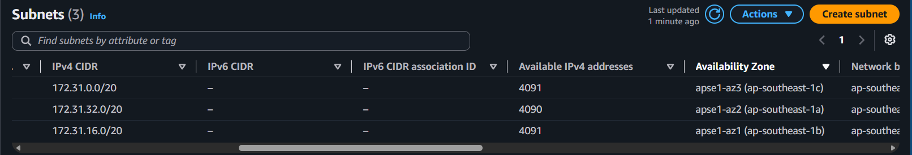
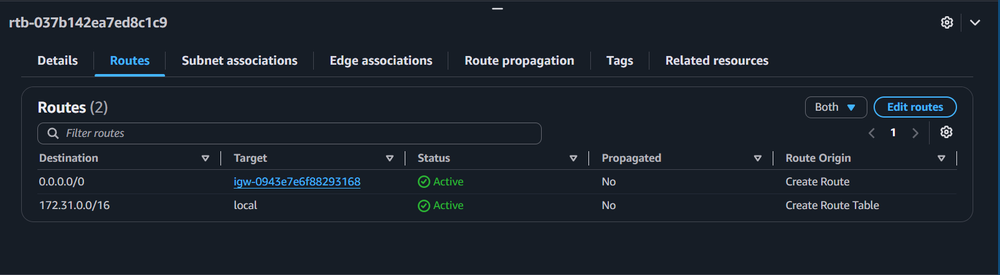
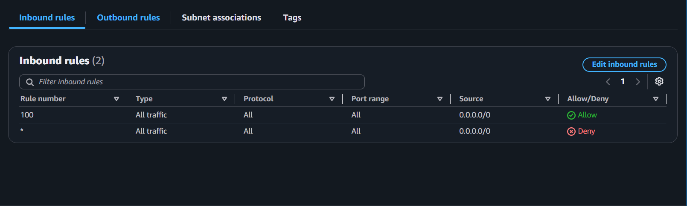
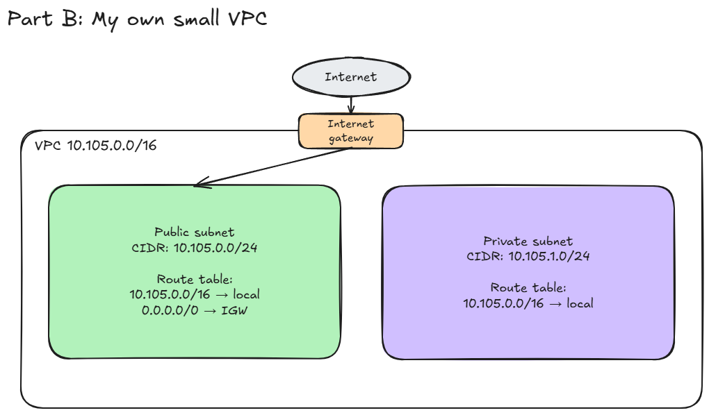

# Assignment 2 Submission

## About me

- GitHub username: cess-O
- Section: IV-ACSAD
- IAM user name that I signed in with: acsad-g01
- X: 105

---

## Part A. Explore

### A1. The VPC

Default VPC IPv4 CIDR:

`172.31.0.0/16`

Number of addresses in that CIDR:

65,536 IPv4 addresses (`2^(32 − 16)`).

### A2. The subnets

| Availability Zone | IPv4 CIDR |
| --- | --- |
| `ap-southeast-1c` | `172.31.0.0/20` |
| `ap-southeast-1a` | `172.31.32.0/20` |
| `ap-southeast-1b` | `172.31.16.0/20` |

### A3. Available addresses

Available IPv4 addresses in each subnet:

| Availability Zone | IPv4 CIDR | Available IPv4 addresses |
| --- | --- | ---: |
| `ap-southeast-1c` | `172.31.0.0/20` | 4,091 |
| `ap-southeast-1a` | `172.31.32.0/20` | 4,090 |
| `ap-southeast-1b` | `172.31.16.0/20` | 4,091 |

Why is the number lower than 4,096?

A /20 CIDR block holds 4,096 IP addresses, but AWS automatically reserves five addresses in every subnet for its own internal networking purposes, leaving a maximum of 4,091 usable addresses.

What uses the missing address in the subnet with the lowest number?

The `172.31.32.0/20` subnet only has 4,090 addresses available because one additional IP address (`172.31.37.42`) is currently assigned to the network interface of an EC2 instance.

### A4. The route table

| Destination | Target |
| --- | --- |
| `172.31.0.0/16` | `local` |
| `0.0.0.0/0` | `igw-...` |

### A5. Public or private

Are the default subnets public or private? Which route proves it?

The default subnets are public because their associated route table contains a `0.0.0.0/0` route pointing directly to an internet gateway, which provides a route to the internet.

### A6. The internet gateway

State of the internet gateway:

Attached

What happens to the default subnets if the gateway is detached?

If you detach the gateway, the subnets lose their internet path, so they can no longer access the internet. However, the local route stays active. This means everything inside the VPC can still communicate with each other, as long as the firewall rules allow it.

### A7. NAT gateways

Number of NAT gateways:

0

Can a server in a new private subnet download updates? Why?

A server in a new private subnet could not download internet updates in this setup. It lacks the required outbound path because the subnet has no direct route to an internet gateway and the VPC has no NAT gateway.

### A8. The network ACL

| Rule number | Source | Allow or Deny |
| --- | --- | --- |
| 100 | `0.0.0.0/0` | Allow |
| `*` | `0.0.0.0/0` | Deny |

How is a network ACL different from a security group?

A security group acts as a stateful firewall at the individual instance level, meaning return traffic is automatically allowed. In contrast, a network ACL operates as a stateless firewall at the subnet level and requires explicit rules for both inbound and outbound traffic.

### A9. The default security group

Inbound rule (type and source):

- Type: All traffic
- Source: `sg-0c5b6d4081cf0a534`

Which resources can send traffic to an instance that uses it?

This self-referencing rule permits inbound traffic from any other instances or resources that are currently assigned to this exact same security group.

---

## Part B. Prepare

### B1. Plan two subnets

- Public subnet CIDR: `10.105.0.0/24`
- Private subnet CIDR: `10.105.1.0/24`

### B2. Route tables

Route table of the public subnet:

| Destination | Target |
| --- | --- |
| `10.105.0.0/16` | `local` |
| `0.0.0.0/0` | internet gateway |

Route table of the private subnet:

| Destination | Target |
| --- | --- |
| `10.105.0.0/16` | `local` |

### B3. My VPC diagram

Tool used (Excalidraw, draw.io, Lucidchart, or paper):

Excalidraw

### B4. Predict a change

Can you still open the web page from your laptop? Why?

No, you cannot open its web page from your laptop. Even though the instance has a public IP address, removing the internet gateway route severs the network path required for data to travel between the instance and the outside internet.

Can the instance still reach another instance in the VPC? Why?

Yes, it can still reach another instance in the same VPC. The default `172.31.0.0/16 → local` route remains active, which keeps the internal pathway open for instances to communicate within the VPC as long as the firewall rules permit the traffic.

### B5. Place a database

Which subnet gets the database? Why?

The database server should use the private subnet (`10.105.1.0/24`) because databases handle sensitive information and should never be directly exposed to the internet. This placement avoids a direct internet path while still allowing authorized internal traffic from application servers within the VPC, as permitted by the security group rules.

### B6. My question about VPCs

What is your question, and what made you think of it?

How can understanding public and private subnets in a VPC help me plan my own student projects and collaborate with developers as a UI/UX designer or product manager?

I thought of this because I want to understand how networking decisions relate to my role, especially when planning how users access an application and how its data is protected.
